# SmartFormInstructor - Architecture Diagram

## High-Level System Overview

```mermaid
graph TB
    subgraph "User Layer"
        USER[👤 Application Developer]
        INPUT[📝 User Input<br/>Natural Language]
        SCHEMA[📋 JSON Schema<br/>Form Definition]
        CTX[🗂️ Context<br/>User/Environment Data]
    end

    subgraph "SmartFormInstructor Core"
        API[🎯 SmartFormInstructor<br/>Main Entry Point]
        PROMPT[📄 PromptManager<br/>Generate Prompts]
        VALIDATOR[✅ SchemaValidator<br/>JSON Schema Validation]
        MAPPER[🔄 ObjectMapper<br/>JSON Parsing]
    end

    subgraph "LLM Abstraction Layer"
        CLIENT[🔌 LlmClient Interface]
        SPRING[☁️ SpringAiLlmClient]
        OPENAI[🤖 OpenAiLlmClient]
        MOCK[🧪 MockLlmClient]
    end

    subgraph "External Services"
        LLM[🧠 LLM Provider<br/>OpenAI/Azure/etc]
    end

    subgraph "Data Models"
        REQ[ParsingRequest<br/>• schema<br/>• userInput<br/>• context]
        RES[ParsingResult<br/>• fields: Map<br/>• errors: List]
        FIELD[FieldResult<br/>• value<br/>• confidence<br/>• reasoning<br/>• alternatives]
    end

    USER -->|Provides| INPUT
    USER -->|Defines| SCHEMA
    USER -->|Provides| CTX
    
    INPUT --> REQ
    SCHEMA --> REQ
    CTX --> REQ
    
    REQ --> API
    API --> PROMPT
    API --> VALIDATOR
    API --> MAPPER
    API --> CLIENT
    
    PROMPT -->|System Prompt| CLIENT
    CLIENT --> SPRING
    CLIENT --> OPENAI
    CLIENT --> MOCK
    
    SPRING --> LLM
    OPENAI --> LLM
    
    LLM -->|JSON Response| CLIENT
    CLIENT -->|Raw JSON| MAPPER
    MAPPER -->|Parse| RES
    VALIDATOR -->|Validate| RES
    
    RES --> FIELD
    RES --> USER

    style API fill:#2196F3,stroke:#1976D2,stroke-width:3px,color:#fff
    style PROMPT fill:#9C27B0,stroke:#7B1FA2,stroke-width:2px,color:#fff
    style VALIDATOR fill:#4CAF50,stroke:#388E3C,stroke-width:2px,color:#fff
    style LLM fill:#F44336,stroke:#D32F2F,stroke-width:2px,color:#fff
```



## Core Processing Flow

```mermaid
sequenceDiagram
    participant App as 👤 Application
    participant API as SmartFormInstructor
    participant PM as PromptManager
    participant LC as LlmClient
    participant LLM as 🧠 LLM Provider
    participant SV as SchemaValidator
    participant OM as ObjectMapper

    App->>API: parse(ParsingRequest)
    
    rect rgb(230, 240, 255)
        Note over API,LLM: Attempt 1 (Initial)
        API->>PM: generateSystemPrompt(request)
        PM->>PM: Build prompt with<br/>schema + input + context
        PM-->>API: System prompt
        
        API->>LC: chat(prompt)
        LC->>LLM: API call
        LLM-->>LC: JSON response
        LC-->>API: JSON string
        
        API->>OM: readValue(json)
        OM-->>API: ParsingResult
        
        API->>API: extractValuesJson(result)
        API->>SV: validate(schema, valuesJson)
        SV-->>API: validation errors
    end
    
    alt Validation Success
        API-->>App: ✅ ParsingResult
    else Validation Failed (Retry)
        rect rgb(255, 240, 240)
            Note over API,LLM: Attempt 2-4 (Retry with errors)
            API->>API: generateRetryPrompt(prompt, errors)
            API->>LC: chat(retryPrompt)
            LC->>LLM: API call with error context
            LLM-->>LC: Corrected JSON
            LC-->>API: JSON string
            API->>OM: readValue(json)
            API->>SV: validate(schema, valuesJson)
        end
        
        alt Retry Success
            API-->>App: ✅ ParsingResult
        else Max Retries Exceeded
            API-->>App: ❌ ParsingResult with errors
        end
    end
```



## Data Flow Architecture

```mermaid
flowchart TD
    subgraph Input["📥 Input Layer"]
        I1[User Input<br/>'John is 30 years old']
        I2[JSON Schema<br/>name: string, age: int]
        I3[Context<br/>timestamp, location, user]
    end
    
    subgraph Processing["⚙️ Processing Layer"]
        P1[PromptManager<br/>Build System Prompt]
        P2[LlmClient<br/>Abstract LLM Call]
        P3[ObjectMapper<br/>Parse JSON Response]
        P4[SchemaValidator<br/>Validate Against Schema]
    end
    
    subgraph Retry["🔄 Retry Loop"]
        R1{Validation<br/>Pass?}
        R2[Generate Retry Prompt<br/>with Error Context]
        R3{Max Retries<br/>Reached?}
    end
    
    subgraph Output["📤 Output Layer"]
        O1[ParsingResult]
        O2[FieldResult Map<br/>value, confidence, reasoning]
        O3[ValidationError List]
    end

    I1 --> P1
    I2 --> P1
    I3 --> P1
    
    P1 -->|System Prompt| P2
    P2 -->|LLM Response| P3
    P3 -->|ParsingResult| P4
    
    P4 --> R1
    R1 -->|❌ Fail| R3
    R3 -->|No| R2
    R2 -->|Retry with errors| P2
    R3 -->|Yes| O3
    
    R1 -->|✅ Pass| O1
    O1 --> O2
    O1 --> O3

    style P1 fill:#9C27B0,color:#fff
    style P2 fill:#2196F3,color:#fff
    style P4 fill:#4CAF50,color:#fff
    style R1 fill:#FF9800,color:#fff
    style O1 fill:#00BCD4,color:#fff
```



## Component Architecture


## Retry Mechanism Flow


## Package Structure


## Universal Smart Form Protocol (USFP)


## Key Features Visualization

```mermaid
flowchart LR
    subgraph Features["🌟 Key Features"]
        F1[📋 Schema-First<br/>JSON Schema driven]
        F2[🔄 Auto Retry<br/>Validation loop]
        F3[📊 Rich Output<br/>Confidence + Reasoning]
        F4[🔌 Provider Agnostic<br/>Multiple LLM support]
        F5[🧩 Complex Forms<br/>Nested + Arrays]
        F6[🎯 Context-Aware<br/>Environment data]
    end
    
    subgraph Benefits["✨ Benefits"]
        B1[🚀 Fast Development<br/>Schema = Contract]
        B2[🛡️ Type Safety<br/>Validated output]
        B3[📈 Transparency<br/>Explainable AI]
        B4[🔧 Flexibility<br/>Any LLM provider]
    end
    
    F1 --> B1
    F2 --> B2
    F3 --> B3
    F4 --> B4
    F5 --> B1
    F6 --> B3

    style F1 fill:#E1F5FE
    style F2 fill:#F3E5F5
    style F3 fill:#FFF3E0
    style F4 fill:#E8F5E9
    style B1 fill:#C8E6C9
    style B2 fill:#BBDEFB
    style B3 fill:#FFE0B2
    style B4 fill:#F8BBD0
```



## Example: Leave Request Processing


## LLM Client Abstraction

```mermaid
graph TB
    subgraph Application["Application Code"]
        APP[SmartFormInstructor]
    end
    
    subgraph Abstraction["LlmClient Interface"]
        INTERFACE[📡 LlmClient<br/>+ chat(String prompt)]
    end
    
    subgraph Implementations["Concrete Implementations"]
        SPRING[☁️ SpringAiLlmClient<br/>Uses Spring AI]
        OPENAI[🤖 OpenAiLlmClient<br/>Direct OpenAI API]
        MOCK[🧪 MockLlmClient<br/>For testing]
    end
    
    subgraph Providers["LLM Providers"]
        GPT[OpenAI GPT-4]
        AZURE[Azure OpenAI]
        OTHER[Claude, Gemini, etc.]
    end

    APP -->|depends on| INTERFACE
    INTERFACE -->|implemented by| SPRING
    INTERFACE -->|implemented by| OPENAI
    INTERFACE -->|implemented by| MOCK
    
    SPRING -->|calls| GPT
    SPRING -->|calls| AZURE
    SPRING -->|calls| OTHER
    OPENAI -->|calls| GPT

    style INTERFACE fill:#2196F3,color:#fff
    style APP fill:#4CAF50,color:#fff
```

## Prompt Engineering Flow


## Design Principles

### 🎯 Core Principles

1. **Schema-First Design**
   - JSON Schema defines the contract
   - Business logic in schema, not code
   - Portable and language-agnostic

2. **Separation of Concerns**
   - LLM client abstracted via interface
   - Prompt management separate from logic
   - Validation decoupled from parsing

3. **Fail-Safe Retry**
   - Automatic retry with error feedback
   - Configurable retry limits
   - Graceful degradation

4. **Rich Metadata**
   - Not just values, but confidence + reasoning
   - Alternatives for ambiguous cases
   - Explainable AI decisions

5. **Provider Agnostic**
   - Works with any LLM provider
   - Easy to switch or test with mocks
   - No vendor lock-in

## Summary: 3 Key Components

```mermaid
graph LR
    A[1️⃣ SmartFormInstructor<br/>Orchestrator] --> B[2️⃣ PromptManager<br/>Prompt Engineering]
    B --> C[3️⃣ SchemaValidator<br/>Quality Assurance]
    
    A -.->|uses| D[LlmClient<br/>LLM Abstraction]
    
    E[📥 Input:<br/>Schema + Text + Context] --> A
    C --> F[📤 Output:<br/>Fields + Confidence]

    style A fill:#2196F3,color:#fff
    style B fill:#9C27B0,color:#fff
    style C fill:#4CAF50,color:#fff
    style D fill:#FF9800,color:#fff
```



**Result**: Transform unstructured natural language into validated, structured data with confidence scores! 🚀


