# SmartFormInstructor - Simple Architecture

## What Does It Do?

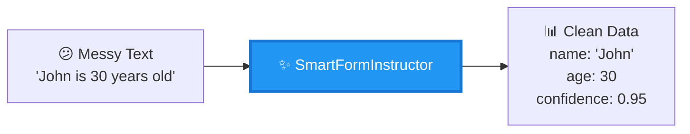

## System Overview (3 Parts)

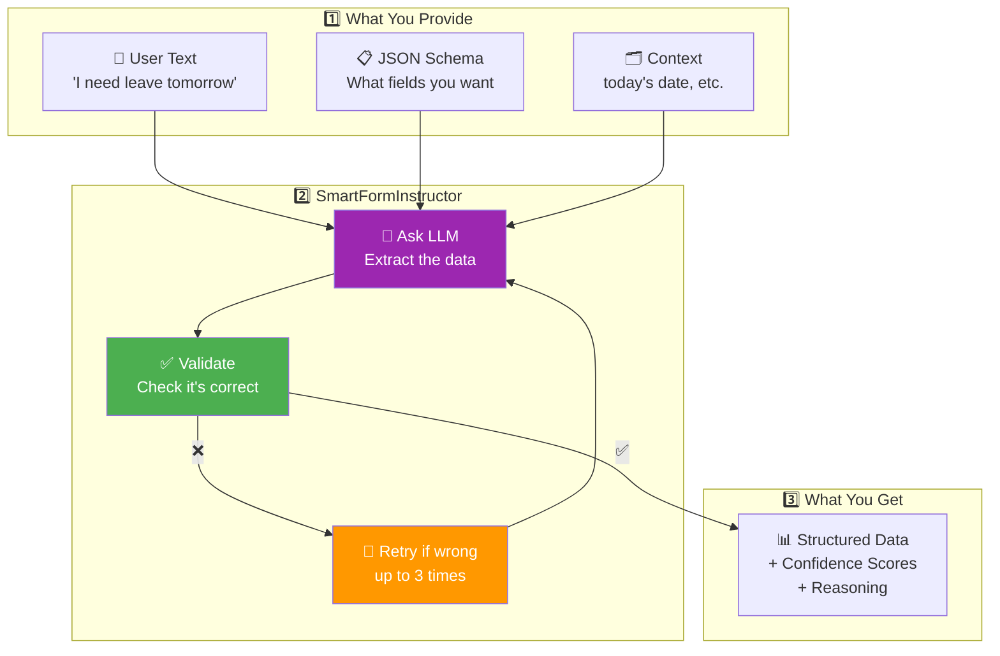

## How It Works (Simple Flow)

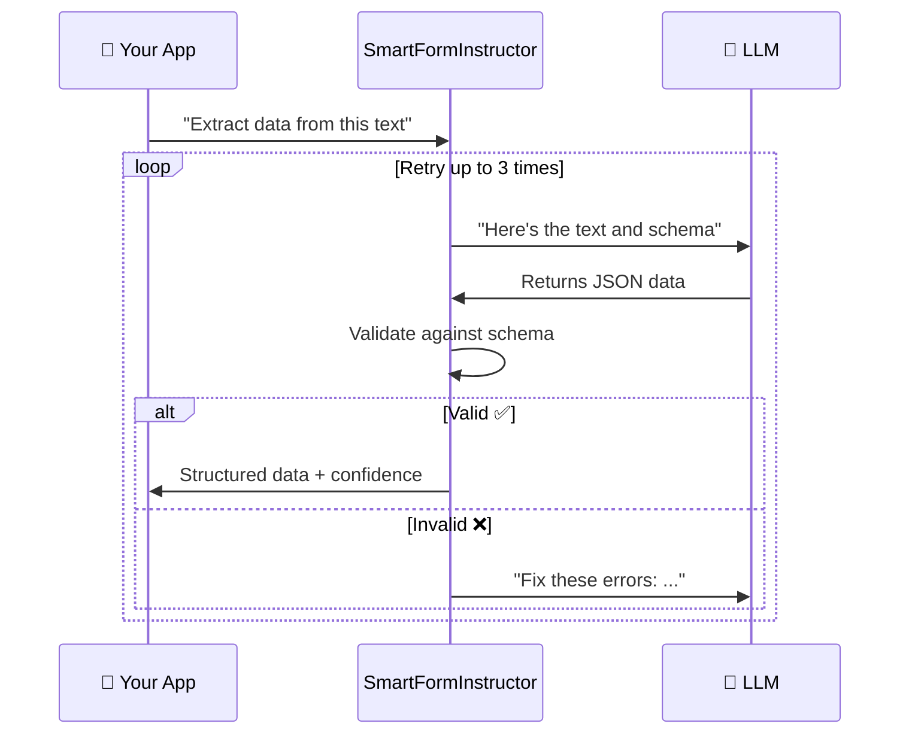

## The Magic: 3 Steps

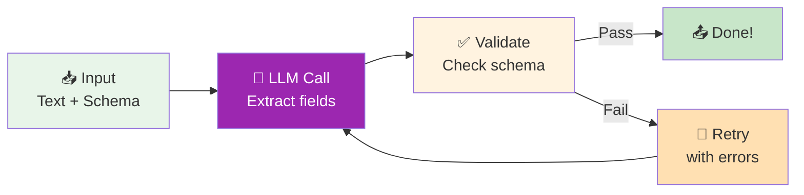

## Core Components (Only 3!)

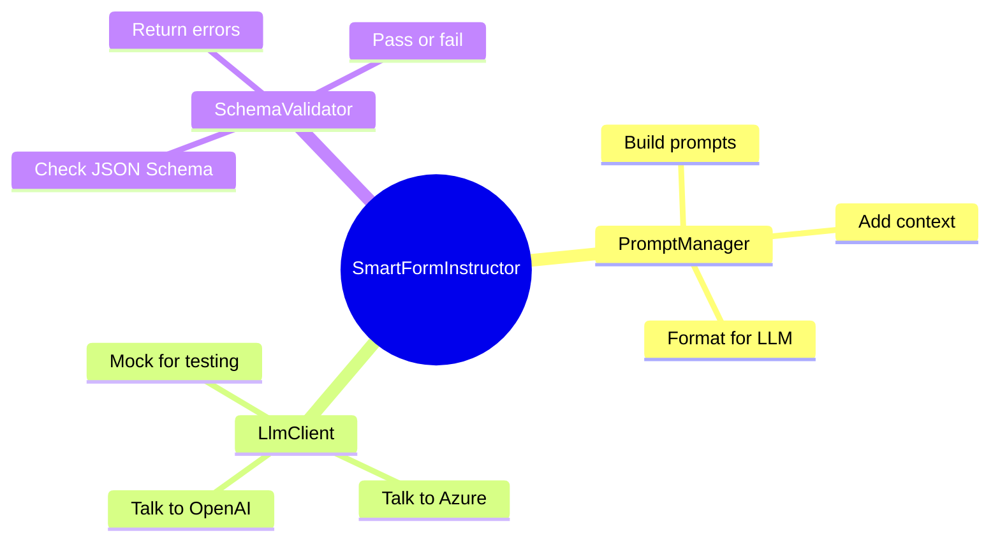

## Example: Real Use Case

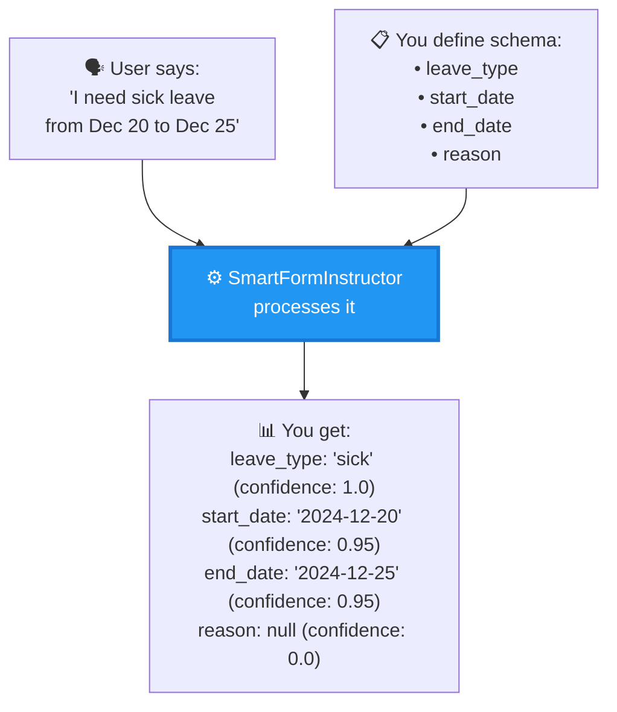

## What You Get Back

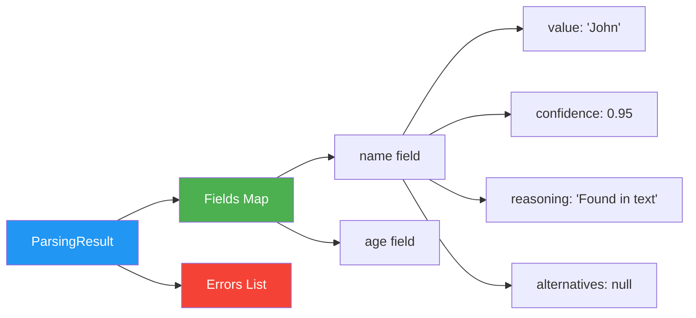

## Architecture Layers

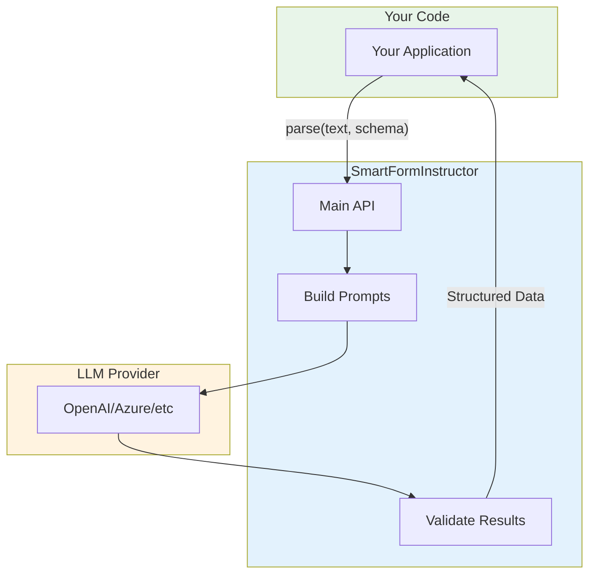

## Key Benefits

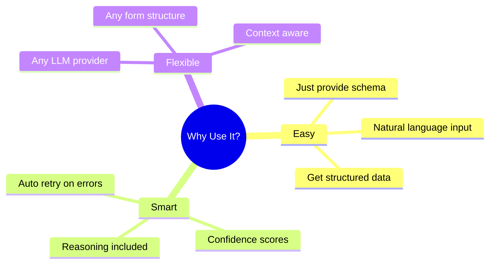

## Quick Start Code

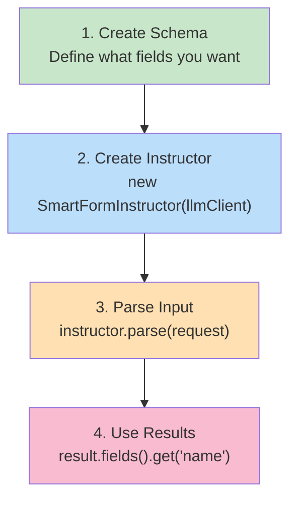

## The Retry Loop (Why It's Smart)

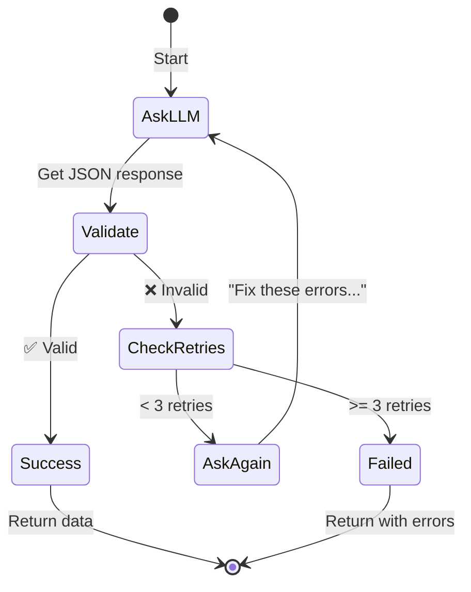

## Simple Architecture Summary

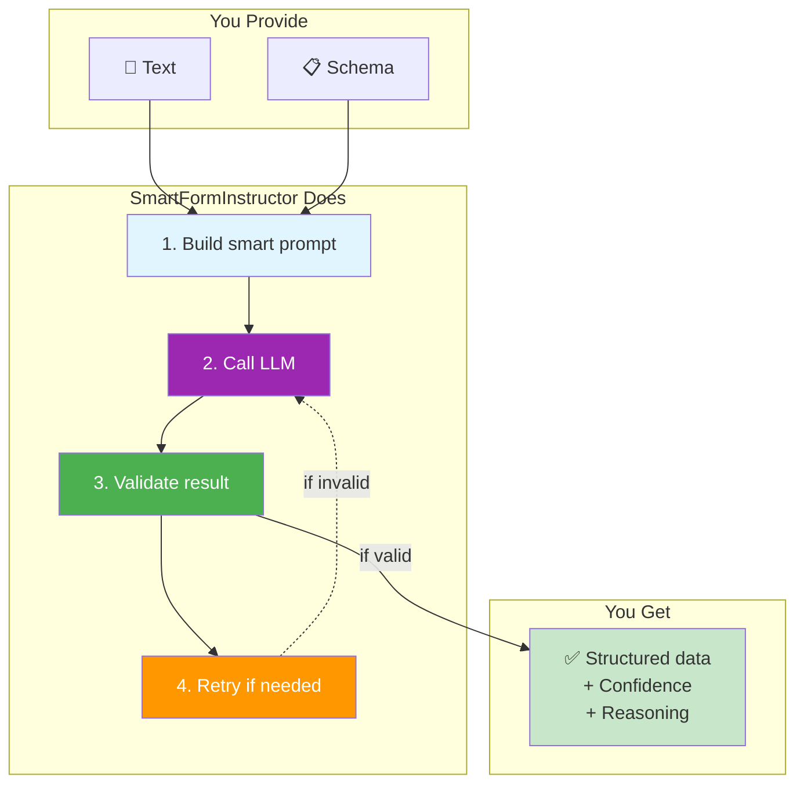

## Real World Comparison

| Without SmartFormInstructor | With SmartFormInstructor |
|---------------------------|-------------------------|
| 😫 Write regex patterns | ✅ Just define schema |
| 😫 Handle all edge cases | ✅ LLM handles variations |
| 😫 Manual validation | ✅ Auto validation + retry |
| 😫 No confidence scores | ✅ Know how sure it is |
| 😫 Hard to debug | ✅ Reasoning included |

## 3 Key Takeaways

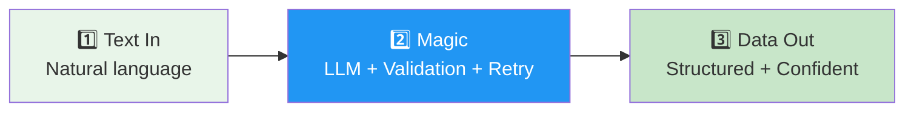

## That's It! 🎉

**In One Sentence:**
> SmartFormInstructor turns messy text into clean, validated, structured data using LLMs with automatic retry and confidence scoring.

**Use It For:**
- 📝 Form filling from natural language
- 📊 Data extraction from text
- 🤖 Structured LLM outputs
- ✅ Validated API responses

