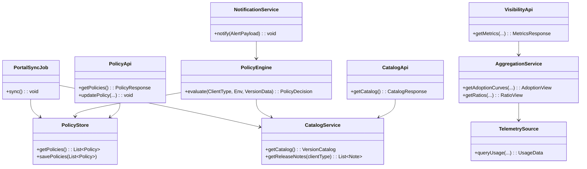
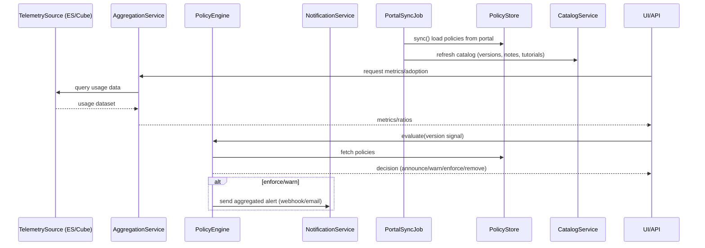

# Design: SDK Version Governance Service (SVG)

## Context
Build a dedicated service that provides: (1) visibility into agent/SDK versions across environments, (2) lifecycle policy management (announce → warn → enforce → remove), (3) integration with release portal for policy data, (4) alerts/notifications, and (5) dashboards/APIs for support and product teams.

## Architecture Overview
- **Data Layer**: Read usage telemetry from Elasticsearch/Cube (populated by version telemetry pipeline). Provide aggregation queries for version distribution, adoption curves, and ratio of new/old/deprecated.
- **Policy Engine**: Holds min/recommended/deprecated versions, block flags, timelines/phases. Evaluates enforcement state (announce/warn/enforce/remove) per client type/env.
- **Portal Sync**: Scheduled job pulls repository data from release portal (serviceId=353 endpoint), normalizes, updates policy store and catalog (versions, notes, tutorials).
- **API Layer**: REST endpoints for version catalog, policies, visibility metrics, and audit queries. Optional MMS/dashboard integration surface.
- **Alert/Notification Layer**: Aggregates alerts by namespace/application/sdkVersion; supports webhook/email; dedupe within window; configurable recipients.
- **UI/Dashboard Integration**: Expose metrics for dashboards (e.g., MMS) for rollout progress, ratios, and drill-down by env/client type.

## Key Flows
1) **Visibility**: API/UI queries ES/Cube aggregations → returns per-version counts, env splits, rollout percentages (0→50→90→99).
2) **Lifecycle**: Policy engine uses portal data + local overrides → determines phase (announce/warn/enforce/remove) → feeds alerts and enforcement guidance.
3) **Sync**: Scheduled portal sync fetches version repository (min/max/recommended/deprecated, block flags) → updates catalog/policies.
4) **Alerting**: On obsolete/deprecated signals, aggregate by namespace/app/sdkVersion, apply allow/deny scoping, send via webhook/email with configured intervals.

## Components
- **Policy Store**: Persists policy states and timelines; supports overrides per env/tenant.
- **Catalog Service**: Serves supported versions, release notes, tutorials, capabilities (from portal + annotations).
- **Aggregation Service**: Provides pre-built queries for ratios and adoption curves.
- **Notification Service**: Handles channels (email/webhook), aggregation, dedupe windows.
- **Admin UI/API**: Manage policies, recipients, alert intervals, and view audits.

## Configuration (examples)
- Portal: url/token, sync cron (default 02:00 UTC), cache TTL.
- Alerts: channels (email/webhook), aggregate window, recipients, allow/deny lists.
- Policies: default block flags, timeline thresholds for phases, per-client-type overrides.
- Dashboards: MMS integration toggles and endpoints.

## Risks / Mitigations
- **Data freshness**: Mitigate with sync cadences and cache TTLs.
- **Alert noise**: Aggregate/dedupe by namespace/app/sdkVersion; allow/deny lists.
- **Portal dependency**: Fallback to last-known-good cache; alert on sync failures.

## Open Questions
- Required retention and SLA for dashboards/metrics.
- Per-tenant overrides for enforcement and notifications.
- Whether to support additional data sources beyond ES/Cube.

## Diagrams

### Class Diagram

### Sequence: Alert & Visibility Flow

