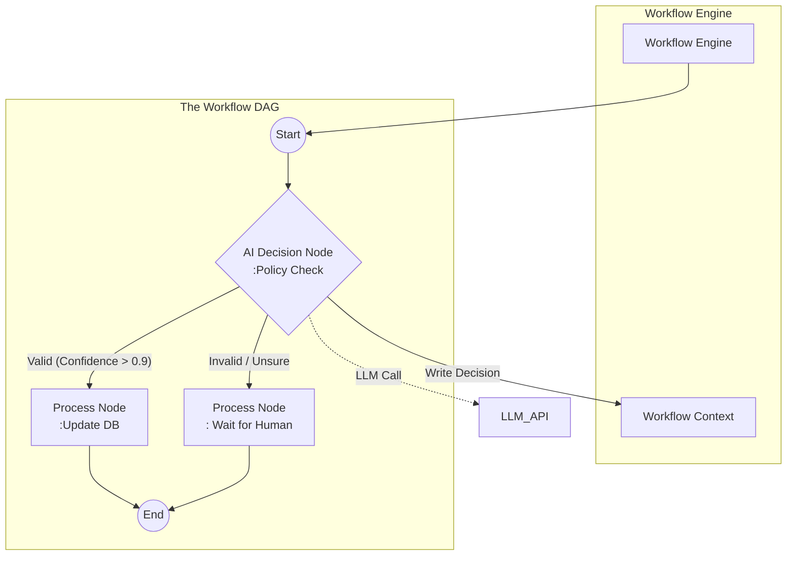
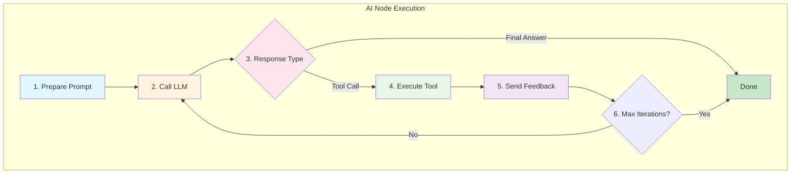

# Design: AI-Driven Workflow Engine

## Context
We are building a workflow engine to process requests through a lifecycle (Validation -> Approval -> Execution). The user has an existing DAG (Directed Acyclic Graph) model with `Start`, `End`, `Decision`, and `Process` nodes. We will enhance this structure by embedding AI capabilities directly into `DecisionNode` and `ProcessNode`.

## Goals
- **AI Decision Maker**: Transform standard `DecisionNodes` into intelligent routers that use LLMs to evaluate complex, semantic conditions (e.g., "Is this reason valid?").
- **Flexible DAG**: Support a graph defined by Nodes and Edges (with conditions).
- **Developer Library**: deliver `smart-form-workflow` as a reusable component.

## Prior Art & Inspiration

We adopt best practices from established platforms to ensure our architecture is robust and flexible.

### 1. N8N (Workflow Automation)
- **Concept**: Node-based execution where data flows as structured JSON objects between steps.
- **Key Learning**: The "Blackboard" pattern (`WorkflowContext`) is superior to strict pipe-and-filter for complex business logic. Nodes often need access to global state (request details, user context), not just the output of the immediate predecessor.
- **Adoption**: Our `WorkflowContext` acts like N8N's global execution state, allowing any node to access `request`, `meta`, or `vars` without complex wiring.

### 2. Dify (LLM App Development)
- **Concept**: AI-native orchestration focusing on "Prompt as Code", RAG integration, and Tool/Function calling.
- **Key Learning**: Treating LLMs not just as text generators but as **routers** and **tool users**. Separating "System Prompt" from "User Input" and providing "Context Variables" is critical for reliability.
- **Adoption**: Our `AiDecisionNode` mimics Dify's "LLM Node" by combining a prompt template, structured output schema, and optional tools.

### 3. Synthesis
- **Hybrid Approach**: We combine N8N's reliable, deterministic DAG structure for control flow with Dify-style AI nodes for semantic reasoning.
- **Benefit**: This gives developers the safety of a state machine (deterministic transitions) with the flexibility of an AI agent (semantic decisions).

## Architecture: The AI-Enhanced DAG

We will implement the 4 node types, injecting AI capabilities where they add the most value:

### 1. Node Types

| User's Node | Implementation Class | AI Capability (The "Brain") |
| :--- | :--- | :--- |
| **StartNode** | `StartNode` | Entry point; initializes the `WorkflowContext`. |
| **EndNode** | `EndNode` | Exit point; returns the final `WorkflowResult`. |
| **DecisionNode** | `AiDecisionNode` | **Reviewer**: Uses LLM to evaluate context against natural language policies.<br>_Example_: "Reject if the tone is unprofessional." |
| | `LogicDecisionNode` | **Rule Engine**: Standard deterministic checks.<br>_Example_: `amount > 5000`. |
| **ProcessNode** | `AiProcessNode` | **Worker**: Uses LLM to generate content or transform data.<br>_Example_: "Draft approval email", "Summarize history". |
| | `ActionNode` | **Tool User**: Executes Java code or calls external APIs.<br>_Example_: `db.save()`, `emailService.send()`. |

### 2. Workflow Definition (DAG)

We will support defining the graph programmatically:

```java
WorkflowGraph graph = new WorkflowGraph();

// Define Nodes
var start = new StartNode();
var aiValidate = new AiDecisionNode("ValidationPolicy", "Is the leave reason valid?");
var managerApproval = new ActionNode(ctx -> sendSlackNotification(ctx));
var autoApprove = new ActionNode(ctx -> db.updateStatus("APPROVED"));
var end = new EndNode();

// Define Edges (Flow)
graph.connect(start, aiValidate);

// AI Decision Branching
graph.connect(aiValidate, autoApprove, result -> result.isApproved() && result.confidence > 0.9);
graph.connect(aiValidate, managerApproval, result -> !result.isApproved() || result.confidence <= 0.9);

graph.connect(autoApprove, end);
graph.connect(managerApproval, end);
```

### 3. Context & Execution
- **WorkflowContext**: A shared "Blackboard" passed between nodes.
    - AI Nodes read from it (e.g., `request.reason`).
    - AI Nodes write to it (e.g., `validation.decision`, `validation.reasoning`).

## Architecture Diagram



## Core Abstractions

### WorkflowContext
- Mutable, JSON-like blackboard shared across all nodes.
- Holds:
  - `request`: structured form data (from `ParsingResult`).
  - `state`: current FSM state (REQUEST, PENDING_VALIDATION, ...).
  - `meta`: caller info, environment, correlation IDs.
  - `vars`: arbitrary working variables produced by nodes.
  - `traceLog`: chronological list of node executions.
- API sketch:
  - `get(String path, Class<T> type)`
  - `set(String path, Object value)`
  - `appendTrace(TraceEntry entry)`

### WorkflowNode
- Base interface for all nodes.
- Signature:
  - `NodeResult execute(WorkflowContext ctx)`
- Responsibilities:
  - Read required inputs from `WorkflowContext`.
  - Perform work (decision / process / routing).
  - Optionally write outputs back to `WorkflowContext`.
  - Return `NodeResult` (status + optional payload or next-edge hint).

### WorkflowEdge
- Directed connection between two nodes.
- Optional condition predicate:
  - `boolean canTraverse(WorkflowContext ctx, NodeResult result)`
- Metadata:
  - `label` (e.g., "APPROVED", "REJECTED", "LOW_CONFIDENCE").
  - `priority` (used when multiple edges are eligible).

### Node Categories
- `StartNode`: creates or hydrates the initial `WorkflowContext`.
- `EndNode`: terminates execution; returns a `WorkflowResult`.
- `DecisionNode`:
  - `LogicDecisionNode`: pure code / rules.
  - `AiDecisionNode`: LLM-backed policy evaluation.
- `ProcessNode`:
  - `ActionNode`: side-effectful, deterministic actions.
  - `AiProcessNode`: LLM-backed transformations / generation.

## AiDecisionNode – AI Decision Maker

`AiDecisionNode` is the core AI decision maker.

### Input Contract
- Subset of `WorkflowContext`, typically:
  - `request` (form fields).
  - `state` (current lifecycle stage).
  - relevant `vars` (e.g., historical approvals).
  - optional `policies` (textual rules or JSON policies).
- Node configuration:
  - **system prompt** (policy description).
  - **output schema** (JSON Schema) for the decision.

### Output Contract
- LLM is instructed to return strict JSON, validated via the existing `SchemaValidator`:
  ```json
  {
    "decision": "APPROVE | REJECT | ESCALATE | ADJUST",
    "confidence": 0.0,
    "reason": "string",
    "recommended_state": "PENDING_APPROVAL | REJECTED | NEEDS_ADJUSTMENT"
  }
  ```
- On success:
  - Parsed into `NodeResult` (decision, confidence, payload).
  - Written to `WorkflowContext` (e.g., `vars.approval.decision`).
- On schema validation failure:
  - Retry with validation-aware prompt (same pattern as SmartFormInstructor).
  - After N failed attempts, emit an error `NodeResult` to route to a safe edge.

### Confidence & Escalation Rules
- Thresholds (configurable per node):
  - `>= 0.9`: high confidence → follow LLM decision edge (e.g., auto-approve).
  - `0.6–0.9`: medium → route to `HumanApprovalNode` or `LogicDecisionNode`.
  - `< 0.6`: low → treat as `UNCERTAIN`, route to manual review or safe default.

### Guardrails
- Prompt discipline:
  - Explicit instructions to never violate hard constraints (e.g., max leave days).
  - Explicit list of allowed decisions.
- Hard checks:
  - Deterministic pre/post checks around AI decision.
  - If AI suggests an invalid decision, engine overrides and logs a policy violation in `traceLog`.

## Process Nodes – Workers

### ActionNode
- Executes deterministic, side-effectful work:
  - DB writes, HTTP calls, notifications.
- Requirements:
  - Prefer idempotent implementations to support retries.
  - Clear error signaling (exceptions converted into error `NodeResult`).

### AiProcessNode
- Uses an LLM to generate or transform data:
  - Summaries, explanations, email drafts, remediation suggestions.
- Contracts:
  - Input: selected pieces from `WorkflowContext` (e.g., request + history).
  - Output: structured or free-form text, optionally schema-validated.
  - Writes results back (e.g., `vars.emailDraft`, `vars.summary`).

## Workflow Definition & Configuration (DAG DSL)

Alongside the Java builder API, we support a simple JSON/YAML DSL so workflows can be configured without code deployments.

Example YAML:
```yaml
nodes:
  - id: start
    type: StartNode
  - id: validate
    type: AiDecisionNode
    config:
      policyPrompt: |
        You are a leave validator...
      outputSchemaRef: validation-decision-schema.json
  - id: auto_approve
    type: ActionNode
    config:
      actionRef: approveLeaveInDb
  - id: human_review
    type: ProcessNode
    subtype: HumanTask
  - id: end
    type: EndNode

edges:
  - from: start
    to: validate
  - from: validate
    to: auto_approve
    condition: "decision == 'APPROVE' && confidence >= 0.9"
  - from: validate
    to: human_review
    condition: "decision == 'ESCALATE' || confidence < 0.9"
  - from: auto_approve
    to: end
  - from: human_review
    to: end
```

Mapping to state diagram:
- FSM transitions (REQUEST → PENDING_VALIDATION → PENDING_APPROVAL → ...) are derived from which nodes executed and which edges were taken.
- After key nodes, the engine updates `WorkflowContext.state` to keep the business lifecycle in sync.

## Observability, Tracing, and Explainability

### TraceLog
- Every node execution appends a `TraceEntry`:
  - `nodeId`, `nodeType`
  - `inputSummary` (selected fields only)
  - `outputSummary`
  - For LLM nodes:
    - prompt identifier or hash
    - sanitized prompt variables
    - response (full or truncated)
    - validation errors (if any)
- Uses:
  - Power UI timelines (\"how did we get here?\").
  - Support audits (\"why was this request rejected?\").

### Metrics & Hooks
- Per-node metrics:
  - execution count, latency, error rate.
  - decision distribution (APPROVE/REJECT/ESCALATE).
- Extension hooks:
  - `WorkflowListener` interface for node start/end, errors, completion.

## Safety, Policy, and Human-in-the-Loop

- Deterministic pre-/post-checks around AI nodes enforce non-negotiable rules.
- Policy templates:
  - Reusable, versioned prompt fragments for HR, Finance, etc.
- Human-in-the-loop:
  - `HumanTaskNode` pauses workflow:
    - Persists context and state.
    - Emits notification/event.
    - Resumes when human decision is written via API.

## Testing and Evaluation Strategy

- Deterministic testing:
  - Validate DAG structure (no cycles, valid node IDs).
  - Unit tests for `WorkflowGraph`, `WorkflowEngine`, `LogicDecisionNode`.
- AI behavior testing:
  - Mock `LlmClient` with canned responses for golden tests.
  - Scenario suites covering edge cases (ambiguous reasons, borderline policies).
- Simulation / replay:
  - Ability to replay historical requests through updated workflows to evaluate impact before enabling auto-approval in production.

## Tool Registration & Function Calling

Tools enable AI nodes to invoke external capabilities (APIs, databases, services) during their reasoning process. This is inspired by OpenAI's function calling and DIFY's tool plugins.

### What Are Tools?

Tools are Java methods exposed to the LLM that it can "call" during execution. The LLM:
1. Receives a list of available tools (name, description, parameter schema).
2. Decides which tool(s) to invoke based on the task.
3. Returns a structured tool call request.
4. The engine executes the tool and feeds results back to the LLM.
5. The LLM incorporates the result into its final decision/output.

### Tool Definition

#### 1. Annotation-Based Registration

```java
@WorkflowToolProvider
public class CalendarTools {

    @WorkflowTool(
        name = "check_calendar_availability",
        description = "Check if a user has conflicts during a date range"
    )
    public AvailabilityResult checkAvailability(
        @ToolParam(name = "user_id", description = "The employee ID") String userId,
        @ToolParam(name = "start_date", description = "Start date (ISO format)") String startDate,
        @ToolParam(name = "end_date", description = "End date (ISO format)") String endDate
    ) {
        // Implementation: query calendar service
        return calendarService.checkConflicts(userId, startDate, endDate);
    }
}

@WorkflowToolProvider
public class PolicyTools {

    @WorkflowTool(
        name = "get_leave_balance",
        description = "Get remaining leave days for an employee"
    )
    public LeaveBalance getLeaveBalance(
        @ToolParam(name = "user_id") String userId,
        @ToolParam(name = "leave_type") String leaveType
    ) {
        return hrService.getLeaveBalance(userId, leaveType);
    }

    @WorkflowTool(
        name = "lookup_policy",
        description = "Look up company policy by topic"
    )
    public String lookupPolicy(
        @ToolParam(name = "topic", description = "Policy topic: 'leave', 'expense', 'travel'") String topic
    ) {
        return policyRepository.findByTopic(topic);
    }
}
```

#### 2. Programmatic Registration

```java
ToolRegistry registry = new ToolRegistry();

// Register a lambda-based tool
registry.register(Tool.builder()
    .name("send_notification")
    .description("Send a Slack notification to a channel or user")
    .parameter("channel", "string", "Slack channel or user ID", true)
    .parameter("message", "string", "Message content", true)
    .handler((params, ctx) -> {
        slackClient.send(params.get("channel"), params.get("message"));
        return ToolResult.success("Notification sent");
    })
    .build());

// Register from annotated class
registry.registerProvider(new CalendarTools());
registry.registerProvider(new PolicyTools());
```

### Tool Schema Generation

Tools are converted to OpenAI-compatible function definitions:

```json
{
  "type": "function",
  "function": {
    "name": "check_calendar_availability",
    "description": "Check if a user has conflicts during a date range",
    "parameters": {
      "type": "object",
      "properties": {
        "user_id": {
          "type": "string",
          "description": "The employee ID"
        },
        "start_date": {
          "type": "string",
          "description": "Start date (ISO format)"
        },
        "end_date": {
          "type": "string",
          "description": "End date (ISO format)"
        }
      },
      "required": ["user_id", "start_date", "end_date"]
    }
  }
}
```

### Binding Tools to AI Nodes

```java
// Create AI node with specific tools
AiDecisionNode approvalNode = AiDecisionNode.builder()
    .id("approval_check")
    .systemPrompt("You are a leave approval assistant...")
    .outputSchema(ApprovalDecision.class)
    .tools(registry.getTools("check_calendar_availability", "get_leave_balance", "lookup_policy"))
    .toolChoice(ToolChoice.AUTO)  // AUTO | REQUIRED | NONE | specific tool name
    .maxToolCalls(3)              // Limit iterations
    .build();

// Or bind all tools from a provider
AiProcessNode schedulerNode = AiProcessNode.builder()
    .id("scheduler")
    .systemPrompt("Find the best time slot for this meeting...")
    .toolProvider(new CalendarTools())
    .build();
```

### Tool Execution Lifecycle



**Tool Call Request Example:**
```json
{
  "tool_calls": [{
    "id": "call_123",
    "function": {
      "name": "check_calendar_availability",
      "arguments": "{\"user_id\":\"emp_456\",\"start_date\":\"2024-01-15\"}"
    }
  }]
}
```

**Tool Result Feedback Example:**
```json
{
  "role": "tool",
  "tool_call_id": "call_123",
  "content": "{\"available\": false, \"conflicts\": [\"Team meeting 10-11am\"]}"
}
```

### Tool Result Types

```java
public sealed interface ToolResult {
    record Success(Object data) implements ToolResult {}
    record Error(String errorType, String message) implements ToolResult {}
    record Partial(Object partialData, String continueHint) implements ToolResult {}
}

// Usage in tool handler
@WorkflowTool(name = "search_documents")
public ToolResult searchDocuments(@ToolParam("query") String query) {
    try {
        List<Document> results = searchService.search(query);
        if (results.isEmpty()) {
            return new ToolResult.Error("NO_RESULTS", "No documents found for: " + query);
        }
        return new ToolResult.Success(results);
    } catch (SearchException e) {
        return new ToolResult.Error("SEARCH_FAILED", e.getMessage());
    }
}
```

### Tool Security & Guardrails

```java
// Define tool permissions
Tool dangerousTool = Tool.builder()
    .name("delete_record")
    .description("Delete a database record")
    .permission(ToolPermission.REQUIRES_CONFIRMATION)  // Pause for human approval
    .allowedContexts("admin_workflow")                  // Only in specific workflows
    .rateLimit(5, Duration.ofMinutes(1))               // Max 5 calls per minute
    .build();

// Tool execution hooks for auditing
registry.addExecutionListener(new ToolExecutionListener() {
    @Override
    public void beforeExecute(Tool tool, Map<String, Object> args, WorkflowContext ctx) {
        auditLog.record("TOOL_INVOKE", tool.name(), args, ctx.getCorrelationId());
    }

    @Override
    public void afterExecute(Tool tool, ToolResult result, WorkflowContext ctx) {
        auditLog.record("TOOL_RESULT", tool.name(), result, ctx.getCorrelationId());
    }
});
```

### Example: Leave Approval with Tools

```java
// 1. Define tools
@WorkflowToolProvider
public class LeaveApprovalTools {

    @WorkflowTool(name = "check_leave_balance")
    public int checkLeaveBalance(@ToolParam("user_id") String userId) {
        return hrService.getRemainingDays(userId);
    }

    @WorkflowTool(name = "check_team_coverage")
    public CoverageResult checkTeamCoverage(
        @ToolParam("team_id") String teamId,
        @ToolParam("start_date") String start,
        @ToolParam("end_date") String end
    ) {
        return scheduleService.checkCoverage(teamId, start, end);
    }

    @WorkflowTool(name = "get_pending_approvals")
    public List<LeaveRequest> getPendingApprovals(@ToolParam("manager_id") String managerId) {
        return leaveRepository.findPendingByManager(managerId);
    }
}

// 2. Create AI node with tools
AiDecisionNode approvalNode = AiDecisionNode.builder()
    .id("smart_approval")
    .systemPrompt("""
        You are a leave approval assistant. Evaluate the request using available tools:
        1. Check if the employee has sufficient leave balance
        2. Check if the team has adequate coverage during the requested dates
        3. Consider any pending approvals that might conflict
        
        Return your decision with reasoning.
        """)
    .outputSchema(ApprovalDecision.class)
    .toolProvider(new LeaveApprovalTools())
    .confidenceThreshold(0.85)
    .build();

// 3. Build workflow
WorkflowGraph graph = new WorkflowGraph();
graph.node(new StartNode("start"));
graph.node(approvalNode);
graph.node(new ActionNode("auto_approve", ctx -> leaveService.approve(ctx)));
graph.node(new HumanTaskNode("manager_review"));
graph.node(new EndNode("end"));

graph.edge("start", "smart_approval");
graph.edge("smart_approval", "auto_approve", 
    r -> r.getDecision() == Decision.APPROVE && r.getConfidence() >= 0.85);
graph.edge("smart_approval", "manager_review",
    r -> r.getDecision() == Decision.ESCALATE || r.getConfidence() < 0.85);
graph.edge("auto_approve", "end");
graph.edge("manager_review", "end");
```

## Developer Experience & Integration Points

- Fluent builder API:
  - `WorkflowBuilder.start(startNode).then(aiValidate).branch(...).end(endNode);`
- Pluggable LLM:
  - Reuse existing `LlmClient` abstraction (OpenAI-compatible, Spring AI client).
  - AI nodes accept `LlmClient` and prompt templates.
- Tool registration:
  - `@WorkflowTool` annotation for declarative tool definition.
  - `ToolRegistry` for programmatic registration.
  - Automatic schema generation from Java types.
- SmartFormInstructor integration:
  - Use its JSON Schema validation for:
    - AI decision outputs (as above).
    - Tool parameter validation.
    - Any other AI-generated structured payloads.

## Risks / Trade-offs
- **Complexity**: Debugging AI decisions in a graph can be hard.
    - **Mitigation**: The `WorkflowContext` must maintain a `TraceLog` that records every node execution, the LLM prompt used, the raw output, and the edge taken, and expose this via APIs and metrics for monitoring and audits.

## Acceptance Test Cases

We will validate the design with these core scenarios:

### 1. Deterministic Flow
- **Goal**: Verify graph traversal without AI.
- **Setup**: `Start` -> `LogicDecision` (if amount > 100) -> `Action A` / `Action B` -> `End`.
- **Input**: `{ "amount": 150 }`.
- **Expected**: Trace shows `Start` -> `LogicDecision` -> `Action A` -> `End`.

### 2. AI Decision Routing (High Confidence)
- **Goal**: Verify AI correctly routes based on policy.
- **Setup**: `Start` -> `AiDecision` (Approve if reason is valid) -> `Approve` / `Reject` -> `End`.
- **Input**: `{ "reason": "I am sick", "policy": "Sick leave is valid" }`.
- **Mock LLM**: Returns `{ "decision": "APPROVE", "confidence": 0.95 }`.
- **Expected**: Graph routes to `Approve` node.

### 3. AI Decision Routing (Low Confidence)
- **Goal**: Verify AI escalates when unsure.
- **Setup**: Same as above.
- **Input**: `{ "reason": "My cat is sad" }`.
- **Mock LLM**: Returns `{ "decision": "REJECT", "confidence": 0.4 }`.
- **Expected**: Graph routes to `HumanReview` (based on `< 0.6` threshold config).

### 4. Tool Execution in AI Node
- **Goal**: Verify AI can invoke a registered tool.
- **Setup**: `AiDecisionNode` with `check_balance` tool.
- **Input**: `{ "user": "alice" }`.
- **Mock LLM**:
  1. Call tool `check_balance("alice")`.
  2. Receive result `10 days`.
  3. Return final decision `APPROVE`.
- **Expected**: Trace log shows Tool Invocation event and final result is `APPROVE`.

### 5. Cycle Detection
- **Goal**: Verify engine prevents infinite loops.
- **Setup**: `Node A` -> `Node B` -> `Node A`.
- **Expected**: `WorkflowEngine` throws `WorkflowDefinitionException` on graph validation.

## Deliverables

### 1. Core Library: `smart-form-workflow`
A reusable Java library providing:
- `WorkflowContext`, `WorkflowNode`, `WorkflowEdge` abstractions.
- `WorkflowGraph` and `WorkflowEngine` for DAG execution.
- Deterministic nodes: `StartNode`, `EndNode`, `LogicDecisionNode`, `ActionNode`.
- AI nodes: `AiDecisionNode`, `AiProcessNode`.
- `ToolRegistry` and function calling support.

### 2. CLI Example: `smart-form-workflow-example`
A command-line application demonstrating a Leave Request workflow:
- **Scenario**: Submit leave request -> AI validates (policy check) -> AI/Logic approves -> Notification.
- **Structure**:
  - `LeaveRequestWorkflowExample.java`: Constructs the DAG and runs it with sample inputs.
  - Console output showing each node execution, decisions, confidence scores, and trace log.

### 3. Web Demo: `smart-form-workflow-web`
A web application to visualize and run workflows interactively:
- **Backend** (Spring Boot):
  - `POST /api/workflows/submit`: Submit a workflow request.
  - `GET /api/workflows/{id}/status`: Poll status and trace logs.
  - `GET /api/workflows/{id}/graph`: Retrieve DAG structure for visualization.
- **Frontend** (Vue.js + TypeScript + Vite):
  - Request input form (leave type, dates, reason).
  - Workflow visualization: DAG with active node highlighting.
  - Decision reasoning panel: Display confidence, reasoning, alternatives.
  - Trace log viewer: Chronological execution history.

